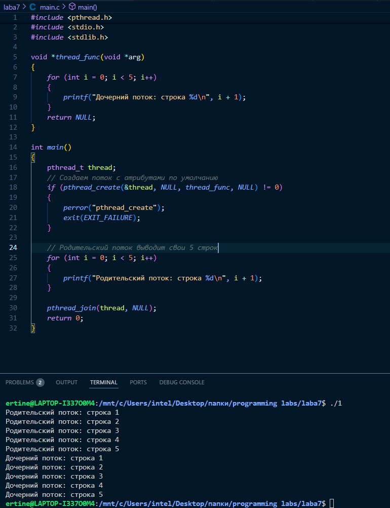
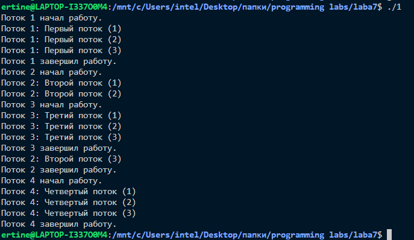
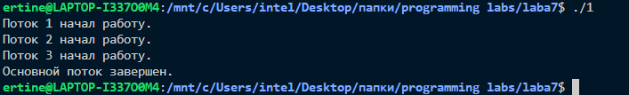
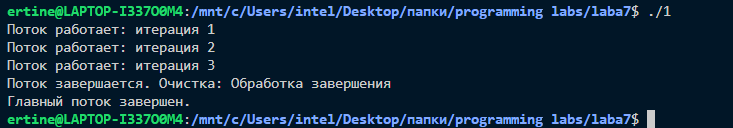
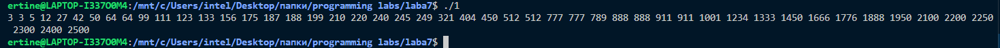

# Лабораторная работа №7: Знакомство с POSIX потоками

Выполнил: Артаа Э.А.  
Группа: ИКС-433  
Дата: 19.05.25

---

## <a name='На-оценку-3'></a>На оценку 3

### <a name='Тема-Первое-знакомство-с-pthread'></a>Тема: Первое знакомство с pthread

<!-- vscode-markdown-toc -->

- 1. [Лабораторная работа №7: Знакомство с POSIX потоками](#Лабораторная-работа-7-Знакомство-с-POSIX-потоками)
  - 1.1. [На оценку 3](#На-оценку-3)
    - 1.1.1. [Тема: Первое знакомство с pthread](#Тема-Первое-знакомство-с-pthread)
    - 1.1.2. [Цель работы](#Цель-работы)
    - 1.1.3. [Процесс](#Процесс)

<!-- vscode-markdown-toc-config
  numbering=true
  autoSave=true
  /vscode-markdown-toc-config -->
<!-- /vscode-markdown-toc -->

# Лабораторная работа №7: Знакомство с POSIX потоками

Выполнил: Артаа Э.А.  
Группа: ИКС-433  
Дата: 19.05.25

---

## <a name='На-оценку-3'></a>На оценку 3

### <a name='Тема-Первое-знакомство-с-pthread'></a>Тема: Первое знакомство с pthread

### <a name='Цель-работы'></a>Цель работы:

- Создание потоков
- Ожидание потоков
- Добавление параметров потока
- Завершение потока без ожидания
- Вывод текста о завершении потока
- Создание простого Sleepsort

### <a name='Процесс'></a>Процесс:

1. Создаем поток с помощью pthread_create()
   Родительский поток выводит текст после завершения дочернего потока

```c
#include <pthread.h>
#include <stdio.h>
#include <stdlib.h>

void* thread_func(void* arg) {
for (int i = 0; i < 5; i++) {
printf("Дочерний поток: строка %d\n", i + 1);
}
return NULL;
}

int main() {
pthread_t thread;

    if (pthread_create(&thread, NULL, thread_func, NULL) != 0) {
        perror("pthread_create");
        exit(EXIT_FAILURE);
    }

    // Ждем завершения дочернего потока
    pthread_join(thread, NULL);

    // После завершения дочернего потока выводим свой текст
    for (int i = 0; i < 5; i++) {
        printf("Родительский поток после join: строка %d\n", i + 1);
    }

    return 0;

}
```



2. Задаем параметры потока

```c
#include <pthread.h>
#include <stdio.h>
#include <stdlib.h>
#define NUM_THREADS 4
// Структура для передачи параметров
typedef struct {
int id;
const char\* message;
} thread_param_t;
void* thread_func(void* arg) {
thread_param_t* param = (thread_param_t*)arg;
// Каждому потоку передается своя последовательность строк
printf("Поток %d начал работу.\n", param->id);
for (int i = 0; i < 3; i++) {
printf("Поток %d: %s (%d)\n", param->id, param->message, i + 1);
// Можно добавить sleep для имитации работы
// sleep(1);
}
printf("Поток %d завершил работу.\n", param->id);
return NULL;
}
int main() {
pthread_t threads[NUM_THREADS];
thread_param_t params[NUM_THREADS] = {
{1, "Первый поток"},
{2, "Второй поток"},
{3, "Третий поток"},
{4, "Четвертый поток"}
};

    for (int i = 0; i < NUM_THREADS; i++) {
        if (pthread_create(&threads[i], NULL, thread_func, &params[i]) != 0) {
            perror("pthread_create");
            exit(EXIT_FAILURE);
        }
    }

    // Ожидаем завершения всех потоков
    for (int i = 0; i < NUM_THREADS; i++) {
        pthread_join(threads[i], NULL);
    }

    return 0;

}
```



3. Дочерний поток перед завершением распечатывает сообщение

```c
   #include <pthread.h>
#include <stdio.h>
#include <stdlib.h>
#include <unistd.h>

#define NUM_THREADS 3

void* thread_func(void* arg) {
    int id = *(int*)arg;

    printf("Поток %d начал работу.\n", id);

    // Имитация работы
    sleep(5);

    printf("Поток %d завершает работу.\n", id);

    return NULL;
}

int main() {
    pthread_t threads[NUM_THREADS];
    int ids[NUM_THREADS];

    for (int i = 0; i < NUM_THREADS; i++) {
        ids[i] = i + 1;
        if (pthread_create(&threads[i], NULL, thread_func, &ids[i]) != 0) {
            perror("pthread_create");
            exit(EXIT_FAILURE);
        }
   }

   // Основной поток ждет две секунды
   sleep(2);

   // Отмена всех дочерних потоков
   for (int i = 0; i < NUM_THREADS; i++) {
       pthread_cancel(threads[i]);
   }

   // Можно дождаться завершения отмененных потоков
   for (int i = 0; i < NUM_THREADS; i++) {
       pthread_join(threads[i], NULL);
   }

   printf("Основной поток завершен.\n");
   return 0;
}
```



4.  Обработать завершение потока с помощью pthread_cleanup_push()

```c
   #include <pthread.h>
#include <stdio.h>
#include <stdlib.h>
#include <unistd.h>

void cleanup_handler(void *arg)
{
    printf("Поток завершается. Очистка: %s\n", (char *)arg);
}

void *thread_func(void *arg)
{
    char *message = "Обработка завершения";
    // Используем pthread_cleanup_push для обработки отмены или выхода из потока
    pthread_cleanup_push(cleanup_handler, message);

    for (int i = 0; i < 10; ++i)
    {
        printf("Поток работает: итерация %d\n", i + 1);

        // Имитация работы и возможность отмены
        sleep(1);
    }

    pthread_cleanup_pop(1); // Выполнить cleanup handler при выходе

    return NULL;
}

int main()
{
    pthread_t thread;

    if (pthread_create(&thread, NULL, thread_func, NULL) != 0)
    {
        perror("pthread_create");
        exit(EXIT_FAILURE);
    }

    // Отправляем сигнал отмены через некоторое время
    sleep(3);
    if (pthread_cancel(thread) != 0)
    {
        perror("pthread_cancel");
    }

    // Ждем завершения потока
    if (pthread_join(thread, NULL) != 0)
    {
        perror("pthread_join");
    }

    printf("Главный поток завершен.\n");
    return 0;
}
```



5 Реализация SleepSort()

```c
#include <stdio.h>
#include <unistd.h>
#include <pthread.h>

void *sleep_print(void *arg)
{
    int a = *(int *)arg;
    usleep(a * 1000); // num микросекунд (* 1000 для точности)
    printf("%d ", a);
    return NULL;
}

int main()
{
    int array[] = {
        42, 187, 5, 249, 123, 156, 789, 99, 175,
        321, 245, 12, 199, 450, 220, 777, 188, 64, 133,
        911, 240, 3, 210, 512, 2200, 777, 1888, 64, 1333,
        911, 2400, 3, 2100, 512, 1666, 888, 2300, 27, 1450,
        1001, 2500, 404, 1950, 111, 2250, 888, 1776, 50, 1234};
    int n = sizeof(array) / sizeof(array[0]);
    pthread_t threads[n];

    for (int i = 0; i < n; i++)
        pthread_create(&threads[i], NULL, sleep_print, &array[i]);

    for (int i = 0; i < n; i++)
        pthread_join(threads[i], NULL);

    puts("");

    return 0;
}
```

## 
